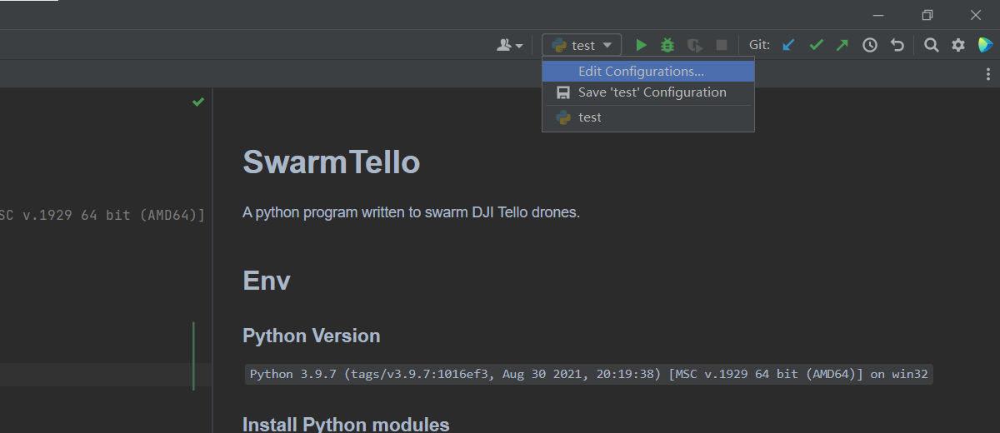
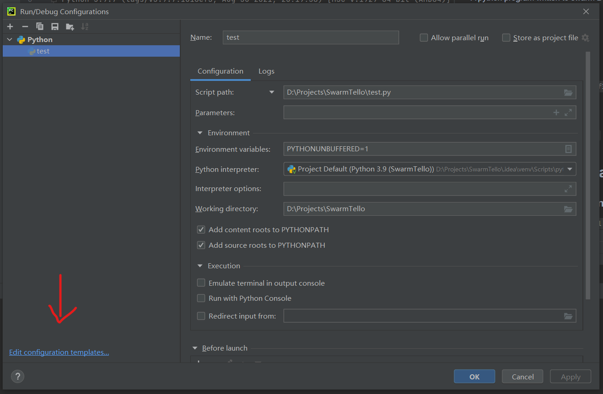
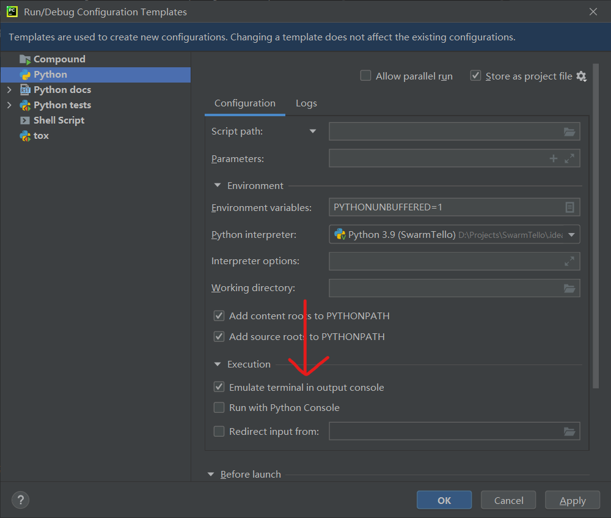
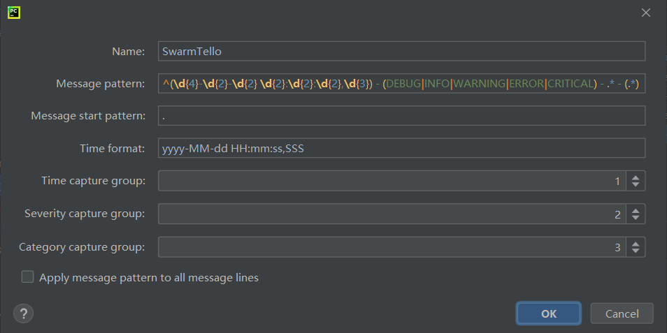
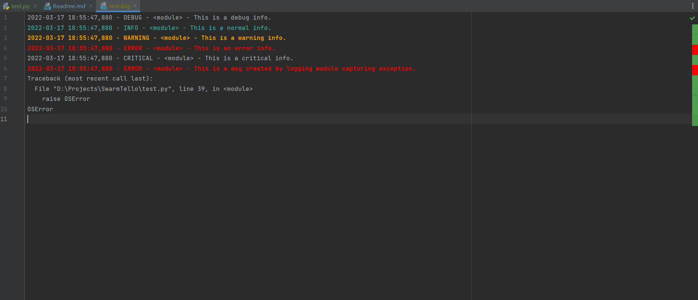

# SwarmTello
An attempt to swarm DJI Tello drones.  

## Env
### Python Version
`Python 3.9.7 (tags/v3.9.7:1016ef3, Aug 30 2021, 20:19:38) [MSC v.1929 64 bit (AMD64)] on win32`  
### Install Python modules
`pip install -r requirements.txt`  

## Jetbrains Configuration
### Enable Emulate terminal in output console
This is necessary for capturing `ctrl + c` signal.  
Click the `Edit Configurations` button.  
  
Click the `Edit confuguration template...` button.  
  
Check the box `Emulate terminal in output console`.  
  
### Enable log highlighting(Optional)
#### Config
Search `Log Highlighting` in settings.  
Add a log format named `SwarmTello`.  
Fill in following information.  

Message Pattern: `^(\d{4}-\d{2}-\d{2} \d{2}:\d{2}:\d{2},\d{3}) - (DEBUG|INFO|WARNING|ERROR|CRITICAL) - .* - (.*)`    
Message Start Pattern: `.`  
Time Format: `yyyy-MM-dd HH:mm:ss,SSS`  
#### Result
You should be able to see highlight in logs.  
  
